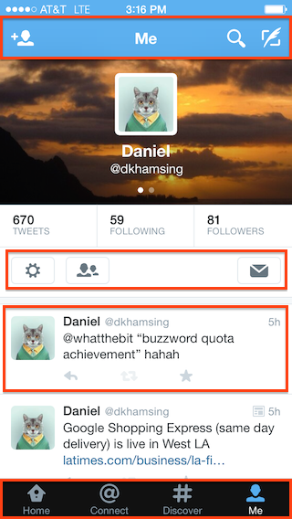
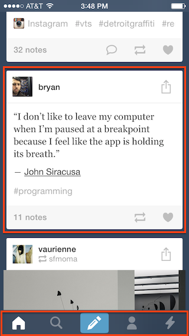

# Guide for Naming Assets in iOS Projects

This guide outlines best practices and [naming conventions](#naming) to help graphic designers and developers manage a large number of icons prepared for an iOS project. 

Your input is welcome: [issues](https://github.com/dkhamsing/ios-asset-names/issues), [pull requests](https://github.com/dkhamsing/ios-asset-names/pulls), or [Twitter](https://twitter.com/dkhamsing) :smile:

## Table Of Contents
* [Namespace](#namespace)
* [Asset Folder](#asset-folder)
* [Asset Type](#asset-type)
* [Naming](#naming)
	* [Uniqueness](#uniqueness)
	* [Prefixing](#prefixing)
	* [Conventions](#conventions)
	* [Special cases](#special-cases)
	* [Collisions](#collisions)
	* [Spelling](#spelling)
	* [Abbreviations](#abbreviations)
* [Acknowledgment](#acknowledgment)


## Namespace
Naming an asset starts with breaking up the user interface of each screen into *namespaces* (or sections). Each namespace represents a logical grouping for the assets and can be used to [create asset names](#naming).

* Shorter is better (one word if possible).
* Meaningful namespace name.
* Use lower case.
* No spaces or special characters (use dashes).
 
Namespaces can correspond to view controllers, typical namespaces are `top`, `bottom`, `content` although more specific names are better.

**Examples**



Twitter profile

- `top` or `top-bar` (shorter than `navigation-bar`)
- `actions` 
- `tweet`
- `tab`



Tumblr home

- `card` or `post` 
- `tab`


Instagram explore

- `top`
- `photo`
- `tab`

## Asset Folder

* [Asset Catalogs](https://developer.apple.com/library/prerelease/ios/documentation/Xcode/Reference/xcode_ref-Asset_Catalog_Format/) is the preferred way to manage assets in Xcode. It eliminates keeping track of files in a project. However naming assets (image sets) is still important especially when collaborating with a designer.
* If you choose to manage assets directly, use a main folder to *store all assets* for the app (usually named `assets` or `images`). This may seem radical but it works in conjunction with [prefixing](#prefixing).
  * An alternative is to use subfolders for each namespace, be aware that subfolders can create problems with asset name [uniqueness](#uniqueness).
  * For extra credit, check out [Structuring an iOS Project](http://www.sebastianrehnby.com/blog/2013/01/15/structuring-an-ios-project/) by [Sebastian Rehnby](https://github.com/sebreh) and the [Synx](https://github.com/venmo/synx) project.


## Asset Type

* Use the [PNG format](https://en.wikipedia.org/wiki/Portable_Network_Graphics) (the JPG format is better for photos)
	* PNG is good for small assets
	* PNG is non-lossy
	* PNG supports transparency 
* Create 1x, 2x and 3x assets in the same folder 
* Add `@2x` or `@3x` at the end of the [appropriate asset name](https://developer.apple.com/library/mac/documentation/GraphicsAnimation/Conceptual/HighResolutionOSX/Optimizing/Optimizing.html)

```
asset.png
asset@2x.png
asset@3x.png
```

To save disk space or time, one can omit the 1x, 2x or 3x asset: the system automatically scales up or down for the appropriate resolution (in particular, you could provide only 2x/3x assets when targeting retina devices). 


## Naming

### Uniqueness

An important attribute of an asset name is uniqueness.

* This prevents confusion: for example having two different `share` assets (say one for iPhone and one for iPad, or one in a main view and one in a detail view).
* More importantly, while it is possible in Xcode to have two files of the same names in different folders, you can only reference one of them using `+ (UIImage *)imageNamed:(NSString *)name`.


### Prefixing

Prefixing is optional but it ensures that asset names are unique across the project.

* Prefix the asset with the app name so you can tell which project it belongs to (use a 2 or 3 letter prefix for long app names).
* Add a device prefix (especially for universal apps with device-specific assets).
* Add a `namespace` prefix so you can quickly organize your assets.
* Format: `project`-`device`-`namespace`-`asset-name`.png

```
ss-ipad-intro-arrow-right.png 
bpc-iphone-intro-arrow-right.png 

twitter-iphone-top-user.png
twitter-iphone-top-search.png
twitter-iphone-top-write.png

tumblr-iphone-card-action.png
tumblr-iphone-card-comment.png
tumblr-iphone-card-reblog.png
tumblr-iphone-card-heart.png
```

### Conventions

* **The asset name describes the icon**, not the function of the icon (when possible, see [special cases](#special-cases)).
* Use lower case.
* No spaces or special characters (use dashes).

**Examples**
```
ss-rack-minus.png 
ss-top-bars.png 
ss-tree-check.png
```

**Not**

```
delete.png 
menu.png
selected.png
```

While CamelCase is the convention in Objective-C, it does not necessarily mean it needs to be applied to asset names (by all means feel free to use it if you prefer `SSRackMinus.png`).


#### Notable

* `chevron` for `>`
* `caret` for `►`


#### Special cases 

Sometimes the name is well represented by its function (refer to [Charbase](http://www.charbase.com/21bb-unicode-clockwise-open-circle-arrow) for Unicode).

* `refresh` for `open circle arrow` (⟳ U+21BB)  
* `edit` for `pencil` (✎ U+270E) 
* `search` for `magnifying glass` (🔍 U+1F50D) 
* `user` for `bust in silhouette` (👤 U+1F464) 
* `comment` for `speech balloon` (💬 U+1F4AC)


#### Collisions 

Should two assets have the same name, add a qualifier at the end.


##### Color qualifer

```
ss-top-plus-pink.png
ss-top-plus-gray.png
```


##### Shape qualifer

* `*-square` 
* `*-circle`
* `*-o` for outline

```
ss-top-arrow-right-circle.png
ss-top-arrow-right-square.png
```


##### Combine shapes

* `*-square-o` for square outline


##### Direction qualifer 

* `*-right`
* `*-left`
* `*-up`, etc

```
ss-top-arrow-right.png
ss-top-arrow-square-right.png
```


##### Buttons (control states)

* `*-normal`
* `*-selected`
* `*-highlighted`, etc

```
ss-profile-gear-normal.png
ss-profile-gear-highlighted.png
```

##### Orientation

* `*-portrait`
* `*-landscape`
* `*-landscape-right`, etc

See more information by Apple on [Launch Files](https://developer.apple.com/library/prerelease/ios/documentation/UserExperience/Conceptual/MobileHIG/LaunchImages.html).

### Spelling

In the US, we would favor American over British spelling (sorry M'lady).

**Examples**
```
ss-top-hanger-gray.png  
ss-tree-color-swatch.png 
```

**Not**

```
hanger-grey.png  
colour-swatch.png 
```


### Abbreviations

Do not abbreviate.

**Examples**
```
ss-share-facebook.png 
ss-share-twitter.png  
```

**Not**
```
fb.png
tw.png
```


## Acknowledgment

This guide was inspired by the [NYTimes Objective-C Style Guide](https://github.com/NYTimes/objective-c-style-guide) and  [Font Awesome](http://fontawesome.io/).

Special thanks to the following individuals for their feedback: [Ash Furrow](https://github.com/AshFurrow), [Sergio Campama](https://github.com/sergiocampama), [Matteo Crippa](https://github.com/matteocrippa), [Marco Sousa](https://twitter.com/h1brd), [Dave McKinney](https://twitter.com/davidkmckinney). 


## Contact
- [github.com/dkhamsing](https://github.com/dkhamsing)
- [twitter.com/dkhamsing](https://twitter.com/dkhamsing)
